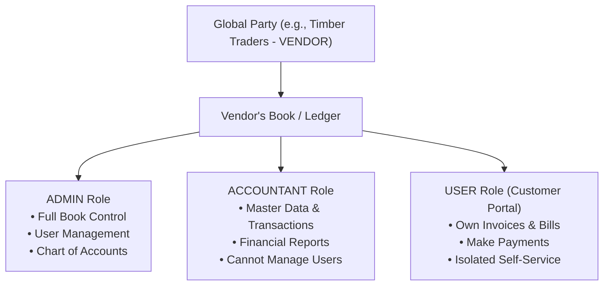

# 🏢 Multi-Party Double-Entry Accounting System

<p align="center">
  <a href="#-stack--technologies">
    
    
    
    
  </a>
  <br/>
  <a href="#-stack--technologies">
    
    
    
    
  </a>
</p>

> **A Next-Generation Double-Entry Bookkeeping Engine for B2B Ecosystems**  
> Every Rupee that moves between Sellers and Vendors is recorded as an independent, perfectly balanced pair of journal entries across isolated ledgers—computed live with zero summary tables or data drift.

---

## 📑 Table of Contents

- [✨ Core Concept & Multi-Party Architecture](#-core-concept--multi-party-architecture)
- [🛡️ Enforced Invariants & Ledger Rules](#%EF%B8%8F-enforced-invariants--ledger-rules)
- [🧩 Domain Model & Identity Matrix](#-domain-model--identity-matrix)
- [🔄 Deal Lifecycle & Mirrored Workflow](#-deal-lifecycle--mirrored-workflow)
- [🇮🇳 Indian GST Tax Engine (CGST / SGST / IGST)](#-indian-gst-tax-engine-cgst--sgst--igst)
- [🚀 Quick Start & Installation](#-quick-start--installation)
- [🔑 Demo Credentials & Test Logins](#-demo-credentials--test-logins)
- [🔒 Security & Credential Policies](#-security--credential-policies)
- [🧪 Verification & Test Suite](#-verification--test-suite)
- [📁 Project Layout & Architecture](#-project-layout--architecture)
- [💡 Architectural Decisions](#-architectural-decisions)
- [📊 System Capabilities & Feature Status](#-system-capabilities--feature-status)

---

## ✨ Core Concept & Multi-Party Architecture

In standard accounting software, transactions are recorded from a single entity's perspective. In **Urban Furniture**, Sellers and Vendors each maintain their **own complete set of books**, while Customers trade without maintaining accounting records.

```
                  ┌──────────────────────────────────────────────────┐
                  │                 B2B TRADE DEAL                   │
                  │   RFQ ──► ACCEPTED ──► DELIVERED ──► INVOICED    │
                  └────────────────────────┬─────────────────────────┘
                                           │
             ┌─────────────────────────────┴─────────────────────────────┐
             ▼                                                           ▼
  VENDOR'S LEDGER (Book 1)                                   SELLER'S LEDGER (Book 2)
┌──────────────────────────────────────┐                   ┌──────────────────────────────────────┐
│ Dr  Accounts Receivable   ₹11,800.00 │                   │ Dr  Purchase Expense      ₹10,000.00 │
│   Cr  Sales Income        ₹10,000.00 │                   │ Dr  Input CGST + SGST      ₹1,800.00 │
│   Cr  Output CGST + SGST   ₹1,800.00 │                   │   Cr  Accounts Payable    ₹11,800.00 │
└──────────────────────────────────────┘                   └──────────────────────────────────────┘
 (SUM(Debit) = ₹11,800  |  SUM(Credit) = ₹11,800)           (SUM(Debit) = ₹11,800  |  SUM(Credit) = ₹11,800)
```

> [!NOTE]
> **One Deal, Two Ledgers.** Each entry balances strictly on its own. Neither entry references the other party's accounts—the backend posting engine enforces strict book boundaries at compile and runtime.

---

## 🛡️ Enforced Invariants & Ledger Rules

The following non-negotiable accounting rules are enforced in server-side Java code—not merely documented in guidelines:

> [!IMPORTANT]
> 1. **Strict Double-Entry Equilibrium:** `JournalPostingService` is the sole gateway for writing to `journal_entry` and `journal_line`. It evaluates the fully assembled entry and rejects any attempt to persist where $\sum \text{Debit} \neq \sum \text{Credit}$.
> 2. **Transaction Atomicity:** `JournalPostingService` executes with `Propagation.MANDATORY`. Any posting error immediately rolls back the originating business document.
> 3. **Zero Cross-Book Leakage:** A journal entry cannot reference accounts or journals across different books. Mirrored transactions post to separate isolated books.
> 4. **Live Ledger Aggregation:** Balance Sheets, P&L statements, Trial Balances, and Aging reports aggregate directly from `journal_line` records at request time—eliminating summary caches and drift.
> 5. **Server-Side Trust Boundary:** Financial amounts, line totals, document totals, and tax breakdowns are calculated strictly on the server. Client requests carry only raw quantities, unit prices, and tax rates.
> 6. **Append-Only Immutable Ledger:** Posted journal entries cannot be edited or deleted. Adjustments and cancellations require reversing entries.
> 7. **Fail-Closed Access Scope:** User permissions and book scopes are extracted directly from authenticated JWT security context, ignoring request-payload parameters.

---

## 🧩 Domain Model & Identity Matrix

### Core Entities

| Concept | Description |
|---|---|
| **`Party`** | Global trade entity (`SELLER`, `VENDOR`, or `CUSTOMER`). Shared across books that interact with it. |
| **`Book`** | An isolated ledger containing a complete Chart of Accounts, Journals, and Ledger Lines. Created for Sellers and Vendors. |
| **`Contact`** | A book-specific representation of a counterparty pointing to a global `Party`. |
| **`Deal`** | The parent commercial agreement spanning both parties. |
| **`Document`** | Book-specific financial paperwork (Invoices, Bills, Orders). Mirrored for B2B trades. |
| **`Settlement`** | Shared money movement recorded as a distinct `Payment` inside each book. |

### Two-Dimensional Access Control

User permissions decouple **Party Role** (What an organization *is*) from **Access Level** (What an employee *can do*):



| Access Level | Capabilities & Boundaries |
|---|---|
| 👑 **`ADMIN`** | Complete ownership over their book: Users, Chart of Accounts, Transactions, and Financial Reports. |
| 💼 **`ACCOUNTANT`** | Full transactional access: Master Data, Sales/Purchase Posting, Financial Reports. Blocked from User Admin & Chart configuration. |
| 👤 **`USER`** | Customer Self-Service Portal access only: View assigned invoices, inspect payment history, and execute payments. |

---

## 🔄 Deal Lifecycle & Mirrored Workflow

Transactions move through a state machine before impacting the general ledger:

```
[RFQ_DRAFT] ──► [RFQ_SENT] ──► [ACCEPTED] ──► [DELIVERED] ──► [INVOICED] ──► [PARTIALLY_PAID] ──► [PAID]
                    │                                            │
                    ▼                                            ▼
               [REJECTED]                             (Posts Balanced Entries)
```

> [!TIP]
> `CANCELLED` status is available prior to the `INVOICED` state. Once invoiced, financial records are immutable and must be settled or reversed.

| Stage | Ledger Effect | Actor Authorization |
|---|---|---|
| **1. Create & Send RFQ** | None (Commercial proposal) | Buyer |
| **2. Accept / Reject** | None | **Counterparty Only** (Prevents self-acceptance) |
| **3. Mark Delivered** | None | **Supplying Party Only** |
| **4. Post Invoice** | **Posts balanced entries to BOTH ledgers simultaneously** | Supplying Party (Post-delivery only) |
| **5. Settlement** | **Posts Cash/Bank payment entries to BOTH ledgers** | Either party (Up to outstanding balance) |

---

## 🇮🇳 Indian GST Tax Engine (CGST / SGST / IGST)

The tax engine computes taxes by comparing the frozen **Place of Supply** against the Supplier's registered state:

```
                          ┌────────────────────────────┐
                          │   Place of Supply Match?   │
                          └─────────────┬──────────────┘
                                        │
                       ┌────────────────┴────────────────┐
                       ▼                                 ▼
           YES (Intra-State Trade)            NO (Inter-State Trade)
        ┌───────────────────────────┐     ┌───────────────────────────┐
        │  CGST = Round(Tax / 2)    │     │  IGST = Full Tax Rate     │
        │  SGST = Tax - CGST        │     │  Account: Output IGST     │
        └───────────────────────────┘     └───────────────────────────┘
```

> [!NOTE]
> Halves are rounded dynamically via $CGST = \text{round}(\text{Tax} / 2)$ and $SGST = \text{Tax} - CGST$ to guarantee zero-paisa discrepancy and preserve double-entry balance across odd paisa figures.

---

## 🚀 Quick Start & Installation

### Prerequisites

Ensure you have the following installed on your machine:
- **Java Development Kit (JDK 21+)**
- **Node.js 20+** & **npm**
- **PostgreSQL Database** (Local instance or [Neon Postgres](https://neon.tech))

---

### 1️⃣ Backend Setup

1. Copy the sample environment file in `backend/src/main/resources`:
   ```bash
   cd backend/src/main/resources
   cp application-local.yml.example application-local.yml
   ```

2. Edit `application-local.yml` with your database connection details and a base64-encoded 32-byte secret:
   ```yaml
   spring:
     datasource:
       url: jdbc:postgresql://localhost:5432/urban_furniture
       username: postgres
       password: postgres

   app:
     jwt:
       secret: T1rDgo4vKFAsG+t8F3K/TcDOhD4xepR077Ts8IyOJsI=
   ```

3. Launch the Spring Boot application using the included Maven wrapper:
   ```bash
   cd backend
   # Linux / macOS:
   ./mvnw spring-boot:run
   # Windows PowerShell:
   .\mvnw.cmd spring-boot:run
   ```
   - **API Server:** `http://localhost:8080`
   - **Swagger UI:** `http://localhost:8080/swagger-ui.html`

---

### 2️⃣ Frontend Setup

1. Install dependencies and start the Vite development server:
   ```bash
   cd frontend
   npm install
   npm run dev
   ```
   - **Web Application:** `http://localhost:5173` *(Vite automatically proxies `/api` calls to port 8080)*.

---

### 3️⃣ Load Demo Data

Seed a complete multi-party ecosystem (3 Organizations, 2 Customers, 9 Complete Trade Workflows):

```powershell
pwsh -File scripts/seed-demo.ps1
```

---

## 🔑 Demo Credentials & Test Logins

| Organization | Role | Login ID | Password | Purpose |
|---|---|---|---|---|
| **Urban Furniture** | Seller Admin | `urbanfurn` | `Passw0rd!23` | Main Furniture Seller Ledger |
| **Timber Traders** | Vendor Admin | `timbertrd` | `Passw0rd!23` | Intra-State Raw Wood Supplier |
| **Mumbai Fittings** | Vendor Admin | `mumbaifit` | `Passw0rd!23` | Inter-State Hardware Supplier (IGST) |
| **Skyline Offices** | Customer Portal | `skylineco` | `Passw0rd!23` | B2B Commercial Customer |
| **Casa Living** | Customer Portal | `casaliving` | `Passw0rd!23` | Residential Retail Customer |

> [!TIP]
> You can also register new custom organizations and users anytime via the UI at `/register`.

---

## 🔒 Security & Credential Policies

Credential validation is strictly strictly enforced at signup:

| Field | Rule Pattern |
|---|---|
| **Login ID** | 6–12 characters, case-insensitive regex: `^[A-Za-z0-9._-]{6,12}$` |
| **Email** | Valid email address, unique across system |
| **Password** | Min 8 chars with upper, lower, & special char. Checked against common-password blocklist |

> [!WARNING]
> **Security Rationale for Password Policy:** Modern passcodes use salted bcrypt hashes (`$2a$`), making cross-user password uniqueness checks computationally prohibitive ($O(N)$ bcrypt hashes on signup) and prone to enumeration attacks. We utilize a high-entropy complexity check paired with a common-password blocklist.

---

## 🧪 Verification & Test Suite

The repository features comprehensive automated backend unit tests and frontend build checks:

```bash
# Backend Test Suite (63 Unit Tests covering Ledger Invariants & Posting Validation)
cd backend && ./mvnw test

# Frontend Type-Check & Production Build
cd frontend && npm run build
```

### Critical Test Coverage Areas

- **`JournalPostingServiceTest`:** Verifies balanced entry persistence, rejection of off-by-one-paisa entries, blocking single-sided lines, and ensuring entries cannot reference foreign accounts or journals.
- **`CredentialPolicyTest`:** Enforces Login ID constraints, password entropy checks, and blocklist security.
- **`TaxCalculatorTest`:** Validates exact intra-state (CGST/SGST) and inter-state (IGST) tax split precision.
- **`AgingBucketTest`:** Tests aging report calculations across exact day boundaries.

---

## 📁 Project Layout & Architecture

```
urban-furniture-accounting/
├── backend/
│   └── src/main/java/com/urbanfurniture/accounting/
│       ├── identity/       # Party, Book, AppUser, Credentials & Registration
│       ├── security/       # JWT Authentication Filters & Book-Scoped Principal
│       ├── ledger/         # Core Double-Entry Engine (JournalPostingService, Chart of Accounts)
│       ├── master/         # Contacts, Products, & Master Data Management
│       ├── trade/          # Deals, Documents, Settlements, & Mirrored Workflows
│       ├── tax/            # Tax Engine (CGST, SGST, IGST Calculation)
│       ├── analytic/       # Cost Centers, Analytic Accounts, & Budgets
│       ├── portal/         # Isolated Customer Self-Service Endpoints
│       ├── report/         # Live Ledger Reports (Balance Sheet, P&L, Trial Balance, Aging)
│       └── db/migration/   # Flyway Database Schemas (V1 Schema, V2 Platform Seeds)
│
├── frontend/
│   └── src/
│       ├── api/            # Typed Axios HTTP Client & API Services
│       ├── auth/           # Authentication Context, Tokens, & Route Guards
│       ├── components/     # UI Design Primitives, Navigation, Shells
│       └── pages/          # Back-Office Modules, Live Financial Reports, & Portals
│
└── scripts/
    └── seed-demo.ps1       # Automated E2E REST API Demo Seeding Script
```

---

## 💡 Architectural Decisions

1. **Programmatic Book Provisioning:** Books are provisioned via `BookProvisioningService` during runtime signup rather than static SQL scripts. This guarantees identical ledger setups for demo data and live users.
2. **Order Paperwork Synchronized on Acceptance:** Agreements spawn mirrored order paperwork in both books simultaneously upon formal counterparty acceptance.
3. **Line-Level Stored GST Breakdowns:** Tax components are persisted directly per document line, preserving historical accuracy even if tax laws or rates change later.
4. **Isolated Customer Portal Tree:** The Customer Portal uses an independent route tree and security scope. Customers are forbidden from backend staff routes at the API layer.
5. **Line-Level Analytic Attribution:** Analytic tags and cost-center allocations live on individual document lines rather than shared deal headers, ensuring independent financial reporting.

---

## 📊 System Capabilities & Feature Status

| Module / Feature | Capabilities | Status |
|---|---|:---:|
| **Multi-Party Bookkeeping** | Isolated Books for Sellers & Vendors | ✅ Complete |
| **Double-Entry Engine** | Real-Time Balanced Posting (`SUM(Debit) = SUM(Credit)`) | ✅ Complete |
| **Mirrored B2B Trade** | RFQ ➔ Accept ➔ Deliver ➔ Invoice ➔ Settlement Workflow | ✅ Complete |
| **Indian GST Engine** | CGST, SGST, IGST calculation & reporting | ✅ Complete |
| **Financial Reporting** | Live Ledger Balance Sheet, P&L, Trial Balance, Aging | ✅ Complete |
| **Customer Portal** | Self-Service Invoice Payment & Tracking | ✅ Complete |
| **Analytic Accounts** | Cost Center Tagging & Budget Tracking | ✅ Complete |
| **Authentication & RBAC** | JWT Auth with ADMIN, ACCOUNTANT, USER roles | ✅ Complete |

---

<p align="center">
  Developed with ❤️ for modern B2B accounting excellence.
</p>
